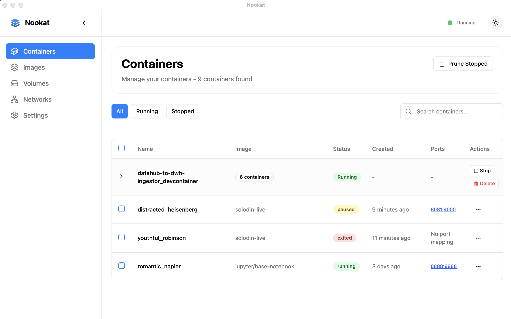

<h1 align="center">
  
</h1>

<p align="center">
Nookat is a lightweight container management tool that provides all the essential features you need without the bloat. Fast, intuitive, and completely free.
</p>

<p align="center">
Built with <strong>Tauri</strong>, <strong>React</strong>, and <strong>TypeScript</strong>.
</p>

<div align="center">


[](https://www.rust-lang.org/)
[](https://reactjs.org/)
[](https://tauri.app/)

</div>

<div align="center">

[](https://github.com/nookat-io/nookat/releases)
[](https://github.com/nookat-io/nookat/releases)
[](https://github.com/nookat-io/nookat/releases)

</div>

<div align="center">

**Get started** [Download](https://github.com/nookat-io/nookat/releases) | [Website](https://nookat-io.github.io)

</div>

---

## Key Features

- **🚀 Lightweight & Fast**: Built with Rust and Tauri for optimal performance
- **📦 Container Management**: Start, stop, and manage containers with ease
- **🖼️ Image Management**: Browse, pull, and manage Docker images
- **🌐 Network Management**: Configure and monitor Docker networks
- **💾 Volume Management**: Handle Docker volumes and data persistence
- **⚙️ Settings & Configuration**: Customize your Docker experience
- **🔧 Auto Container Engine Setup**: Downloads and Installs container engines if needed, with [Colima](https://github.com/abiosoft/colima) as the default
- **🎨 Modern UI**: Clean, intuitive interface built with React and Tailwind CSS
- **🆓 Completely Free**: No premium features, no subscriptions

## Screenshots

<div align="center">


_Container management interface_

</div>

> **📸 More Screenshots Available**
>
> Explore the complete collection of screenshots in the [`screenshots/`](screenshots/) folder, including both light and dark theme variants for all major features

## Installation

### Prerequisites

- **macOS**: macOS 10.15 or later
- **Linux**: Most modern distributions
- **Windows**: Windows 10 or later
- **Any [OCI](https://opencontainers.org/)-compatible container runtime**, or install [Colima](https://github.com/abiosoft/colima) in Nookat app settings
- [Tauri](https://tauri.app/start/prerequisites/) (for development)

### Download Nookat

You can download the latest release from [GitHub Releases](https://github.com/nookat-io/nookat/releases)

### macOS: first launch

The macOS builds are not signed with an Apple Developer ID, so Gatekeeper will refuse to open the app on the first launch with a message like "Nookat cannot be opened because Apple cannot check it for malicious software".
This is expected, and the app is safe - it is built in public from this repository by the [release workflow](.github/workflows/build-macos.yaml).

To allow it, open the DMG, drag Nookat to Applications, and then either:

- Right-click (or Control-click) Nookat in Applications and choose **Open**, then confirm **Open** in the dialog, or
- Open **System Settings -> Privacy & Security**, scroll to the message about Nookat being blocked, and click **Open Anyway**.

You only need to do this once.
Both options keep macOS in charge of checking the app, so use them rather than stripping the quarantine attribute by hand - that would skip the check for every file in the bundle, including on a download that is not actually the one we published.

## Development Setup

### Prerequisites

- [Node.js](https://nodejs.org/) (v18 or higher)
- [Rust](https://rustup.rs/) (latest stable)

### Build from Source

```bash
# Clone the repository
git clone https://github.com/nookat-io/nookat.git
cd nookat

# Install dependencies
npm i

# Set up environment variables
cp env.example .env

# Start development server
npm run tauri dev
```

### Available Scripts

- `npm run tauri dev` - Start Tauri development mode
- `npm run build` - Build for production

> **💡 Pro Tip**: Most of the convenient development scripts are available in the `justfile`. Check out `just --list` to see all available commands, or run `just` to see the most common ones.

## Architecture

Nookat is built with a modern, cross-platform architecture:

- **Frontend**: React with TypeScript and Tailwind CSS
- **Backend**: Rust with Tauri
- **Container Engine**: Colima and Lima as a container runtime
- **Docker API**: bollard-rs for Docker daemon communication

## Contributing

We welcome contributions from the community! Here's how to get started:

1. **Fork** the repository
2. **Create** a new branch (`git checkout -b feature/YourFeature`)
3. **Make** your changes
4. **Commit** your changes (`git commit -am 'Add YourFeature'`)
5. **Push** to the branch (`git push origin feature/YourFeature`)
6. **Open** a Pull Request

## Recommended IDE Setup

- [VS Code](https://code.visualstudio.com/) with extensions:
  - [Tauri](https://marketplace.visualstudio.com/items?itemName=tauri-apps.tauri-vscode)
  - [rust-analyzer](https://marketplace.visualstudio.com/items?itemName=rust-lang.rust-analyzer)
  - [TypeScript Importer](https://marketplace.visualstudio.com/items?itemName=pmneo.tsimporter)

## License

Nookat is licensed under the [Apache License 2.0](LICENSE).

## Acknowledgements

- Built with [Tauri](https://tauri.app/), [React](https://reactjs.org/), and [Rust](https://www.rust-lang.org/), [bollard-rs](https://github.com/fussybeaver/bollard)

## Community

- **GitHub**: [nookat-io/nookat](https://github.com/nookat-io/nookat)
- **Issues**: [Report bugs or request features](https://github.com/nookat-io/nookat/issues)
- **Discussions**: [Join the community](https://github.com/nookat-io/nookat/discussions)

## Support

If you encounter any issues or have questions:

1. Check the [GitHub Issues](https://github.com/nookat-io/nookat/issues) page
2. Search existing discussions
3. Create a new issue with detailed information
4. Join our community discussions

---

<div align="center">

**Made with ❤️ for the container community**

</div>
